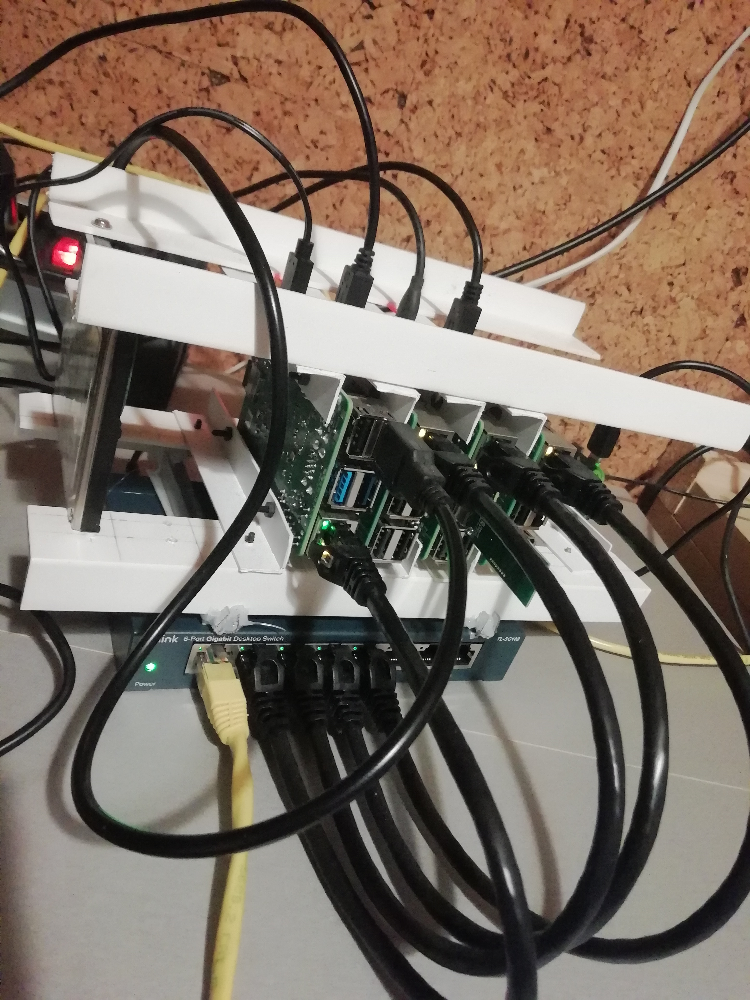

# Hardware

These instructions are for Linux.



## Raspberry Pi

* Raspberry Pi 3 or 4 with 64-bit Raspbian OS
* Use [RPi Imager](https://projects.raspberrypi.org/en/projects/raspberry-pi-setting-up/2) to prepare SD card
  * The RPi Imager has to be started as root:
    ```bash
    sudo rpi-imager
    ```  
  * Choose Raspberry Pi OS Lite (64-bit)
  * Choose your card
  * Do not change anything else - it will be configured later
  * Click the `Write` button

**Further in the text X means node number**

* rpiX: replace X by node number
* 192.168.1.1X: replace X by node number

**Enable ssh**

```bash
sudo touch /media/${USER}/boot/ssh
```

**Set username/password**

* Generate hash of your password:

```bash
echo YOUR_PASSWORD | sudo openssl passwd -6 -stdin > /media/${USER}/boot/userconf
```

* Prepend the hash with user name and semicolon (`pi:`) in the `/media/${USER}/boot/userconf` file, a single line, no spaces, crlf at the end:

    ```conf
    pi:HASH_OF_YOUR_PASSWORD

    ```

**/media/${USER}/rootfs/etc/hostname**

    ```conf
    rpiX
    ```

**/media/${USER}/rootfs/etc/hosts**

```conf
127.0.1.1    rpiX

192.168.1.11 rpi1
192.168.1.12 rpi2
192.168.1.13 rpi3
192.168.1.14 rpi4
192.168.1.14 rpi5
```

**/media/${USER}/rootfs/etc/dhcpcd.conf**

```conf
# Inform the DHCP server of our hostname for DDNS.
hostname rpiX
...
# Static IP configuration:
interface eth0
static ip_address=192.168.1.1X/24
static routers=192.168.1.1
static domain_name_servers=8.8.8.8 8.8.4.4
```

**/media/${USER}/rootfs/etc/fstab**

This reduces SD card wearing.

```conf
tmpfs /tmp tmpfs     defaults,noatime,nosuid,nodev,noexec,mode=0755,size=100m 0 0
tmpfs /var/tmp tmpfs defaults,noatime,nosuid,nodev,noexec,mode=0755,size=30m 0 0
tmpfs /var/log tmpfs defaults,noatime,nosuid,nodev,noexec,mode=0755,size=100m 0 0
```

***/etc/logrotate.conf***

Log rotation:

```conf
minsize 1k
# rotate log files daily
daily
# keep 1 week worth of backlogs
rotate 1
...
```

*** /etc/logrotate.d/rsyslog***

```conf
...
{
        rotate 1
        daily
...
}
```

```bash
sudo systemctl restart logrotate
sudo logrotate -v /etc/logrotate.conf
```

**Remove old ssh keys (optional)**

On your PC:

```bash
ssh-keygen -R rpiX
ssh-keygen -R 192.168.1.1X
```

**Generate new ssh key**

On your PC:

```bash
$ ssh-keygen
Generating public/private rsa key pair.
Enter file in which to save the key (/home/${USER}/.ssh/id_rsa): /home/${USER}/.ssh/id_rpi
Enter passphrase (empty for no passphrase): 
Enter same passphrase again: 
Your identification has been saved in /home/${USER}/.ssh/id_rpi.
Your public key has been saved in /home/${USER}/.ssh/id_rpi.pub.
```

**~/.ssh/config**

On your PC for all nodes:

```conf
Host rpiX
    HostName rpiX
    PreferredAuthentications publickey
    IdentityFile ~/.ssh/id_rpi
    User pi
```

Restart ssh service on your PC:
    
```bash
sudo systemctl restart ssh.service
```

**Install the SD cards in PIs and boot**

**Copy keys to PIs**

On your PC, copy the key to all nodes:

```bash
ssh-copy-id -i ~/.ssh/id_rpi.pub pi@rpiX
```

**Now you should be able to ssh in your PIs**

```bash
ssh rpiX
```

See [doc/docker-swarm.m](docker-swarm.md#docker-swarm) how to install docker and configure a docker swarm.
## Ethernet Switch

* TP-Link 8-port Gigabit Desktop Switch


## Zigbee

[CC2531](https://www.ti.com/product/CC2531) is used as a coordinator.

### C2531 coordinator installation


#### How to flash CC2531 USB stick

* Compiled from [here](https://www.zigbee2mqtt.io/guide/adapters/flashing/alternative_flashing_methods.html) and [here](https://lemariva.com/blog/2019/08/zigbee-flashing-cc2531-using-raspberry-pi-without-cc-debugger)

On rpiX where your CC2531 is inserted into an USB port:

```bash

```bash
sudo apt install git

wget https://github.com/WiringPi/WiringPi/releases/download/2.61-1/wiringpi-2.61-1-arm64.deb
sudo dpkg -i wiringpi-2.61-1-arm64.deb 
$ gpio -v
gpio version: 2.61

git clone https://github.com/jmichault/flash_cc2531.git
cd flash_cc2531/
make
$ ./cc_chipid 
ID=b524
erase result = 00a2

cd
wget https://github.com/Koenkk/Z-Stack-firmware/archive/master.zip
unzip master.zip 
cd Z-Stack-firmware-master/coordinator/Z-Stack_Home_1.2/bin/default/
unzip CC2531_DEFAULT_20211115.zip 

cd flash_cc2531/
./cc_erase 
./cc_write ~/Z-Stack-firmware-master/coordinator/Z-Stack_Home_1.2/bin/default/CC2531ZNP-Prod.hex 

sudo reboot

$ ls -l /dev/serial/by-id
usb-Texas_Instruments_TI_CC2531_USB_CDC___0X0123456789ABCDEF-if00
```

## ESPHome

### ESP8266

### ESP32

### Sonoff TH10

* [Wiring](https://templates.blakadder.com/sonoff_TH.html)
* [Configuration](https://devices.esphome.io/devices/Sonoff-TH10)

Flashing

* Via ESPHome Web UI
* Or CLI
```bash
sudo apt install python-is-python3
~/.arduino15/packages/esp32/tools/esptool_py/3.3.0/esptool.py --before default_reset --after hard_reset --baud 115200 --port /dev/ttyUSB0 --chip esp8266 write_flash -z --flash_size detect 0x0 config/.esphome/build/sonoffth10_1/.pioenvs/sonoffth10_1/firmware.bin
```